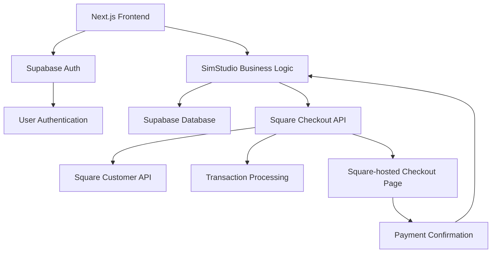

# SimStudio Payment & Authentication Integration Plan

## Overview

This document outlines the implementation plan for integrating Square for payment processing and Supabase Auth for user authentication in the SimStudio booking system. This approach provides a cost-effective solution with transaction-based pricing (2.2% per transaction in Australia) and no monthly fees, while maintaining a robust authentication system with social login options.

## Implementation Status

### Completed
- ✅ Basic Supabase Auth integration
- ✅ Authentication context and provider
- ✅ Login page with email/password authentication
- ✅ Registration page with email/password authentication
- ✅ Email verification page
- ✅ AuthGuard component for protected routes
- ✅ Profile API endpoint
- ✅ Updated Layout component with login/logout UI
- ✅ Square payment integration
- ✅ Update CheckoutForm component to use Square Checkout API
- ✅ Create payment processing API endpoint
- ✅ Connect authentication with payment processing

### Pending
- ⬜ Add social login options (optional)
- ⬜ Testing and refinement

## Table of Contents

1. [Architecture Overview](#architecture-overview)
2. [Square Integration](#square-integration)
3. [Supabase Auth Integration](#supabase-auth-integration)
4. [Database Schema Updates](#database-schema-updates)
5. [API Endpoints](#api-endpoints)
6. [Frontend Components](#frontend-components)
7. [Implementation Timeline](#implementation-timeline)
8. [Testing Plan](#testing-plan)

## Architecture Overview



The architecture leverages:
- **Next.js** for the frontend and API routes
- **Supabase** for authentication and database
- **Square** for payment processing and customer management
- **Square Checkout** for hosted payment pages

## Square Integration

### 1. Setup and Configuration

1. **Install Square SDK**
   ```bash
   npm install square
   ```

2. **Configure Environment Variables**
   ```
   # .env.local
   SQUARE_ACCESS_TOKEN=your_square_access_token
   SQUARE_LOCATION_ID=your_square_location_id
   SQUARE_ENVIRONMENT=sandbox  # or 'production'
   NEXT_PUBLIC_BASE_URL=http://localhost:3000  # Your application URL for redirects
   MERCHANT_SUPPORT_EMAIL=support@simstudio.com  # Optional: Support email shown on checkout page
   ```

3. **Initialize Square Client**
   ```typescript
   // lib/square.ts
   import { SquareClient } from "square";
   
   export const squareClient = new SquareClient({
     token: process.env.SQUARE_ACCESS_TOKEN,
     environment: process.env.SQUARE_ENVIRONMENT === 'production' 
       ? 'production' 
       : 'sandbox'
   });
   ```

### 2. Payment Processing Implementation

1. **Create Checkout API Endpoint**
   ```typescript
   // pages/api/create-checkout.ts
   import { NextApiRequest, NextApiResponse } from 'next';
   import { v4 as uuidv4 } from 'uuid';
   import { supabase } from '../../lib/supabase';
   
   export default async function handler(
     req: NextApiRequest,
     res: NextApiResponse
   ) {
     if (req.method !== 'POST') {
       return res.status(405).json({ error: 'Method not allowed' });
     }
     
     try {
       const { 
         amount, 
         userId, 
         isAuthenticated, 
         firstName, 
         email,
         description 
       } = req.body;
       
       // Generate reference ID for tracking
       const referenceId = uuidv4();
       
       // For guest users, store their information temporarily
       let tempUserId = userId;
       if (!isAuthenticated && email) {
         // Store in temporary table or session
         const { data, error } = await supabase
           .from('temp_users')
           .insert({
             reference_id: referenceId,
             email: email,
             first_name: firstName
           })
           .select();
           
         if (error) throw error;
         tempUserId = data[0].id;
       }
       
       // Create Square Checkout link
       const locationId = process.env.SQUARE_LOCATION_ID;
       const accessToken = process.env.SQUARE_ACCESS_TOKEN;
       const environment = process.env.SQUARE_ENVIRONMENT || 'sandbox';
       
       const baseUrl = environment === 'production' 
         ? 'https://connect.squareup.com' 
         : 'https://connect.squareupsandbox.com';
       
       // Calculate amount in cents
       const amountInCents = Math.round(amount * 100);
       
       // Create checkout link request
       const checkoutRequest = {
         idempotency_key: uuidv4(),
         checkout_options: {
           redirect_url: `${process.env.NEXT_PUBLIC_BASE_URL}/checkout/success?ref=${referenceId}`,
           merchant_support_email: process.env.MERCHANT_SUPPORT_EMAIL || 'support@simstudio.com',
           ask_for_shipping_address: false
         },
         order: {
           location_id: locationId,
           reference_id: referenceId,
           customer_id: isAuthenticated ? userId : undefined,
           line_items: [
             {
               name: description || "SimStudio Booking",
               quantity: "1",
               base_price_money: {
                 amount: amountInCents,
                 currency: "AUD"
               }
             }
           ],
           metadata: {
             user_id: tempUserId,
             is_authenticated: isAuthenticated ? 'true' : 'false',
             reference_id: referenceId
           }
         }
       };
       
       // Call Square API
       const checkoutResponse = await fetch(`${baseUrl}/v2/online-checkout/payment-links`, {
         method: 'POST',
         headers: {
           'Square-Version': '2023-09-25',
           'Authorization': `Bearer ${accessToken}`,
           'Content-Type': 'application/json'
         },
         body: JSON.stringify(checkoutRequest)
       });
       
       const checkoutData = await checkoutResponse.json();
       
       if (!checkoutResponse.ok) {
         throw new Error(checkoutData?.errors?.[0]?.detail || 'Failed to create checkout');
       }
       
       // Return the checkout URL
       return res.status(200).json({
         checkoutUrl: checkoutData.payment_link.url,
         referenceId: referenceId
       });
       
     } catch (error: any) {
       console.error('Checkout error:', error);
       return res.status(500).json({ error: error.message || 'Failed to create checkout' });
     }
   }
   ```

2. **Create Payment Verification Endpoint**
   ```typescript
   // pages/api/verify-payment.ts
   import { NextApiRequest, NextApiResponse } from 'next';
   import { supabase } from '../../lib/supabase';
   
   export default async function handler(
     req: NextApiRequest,
     res: NextApiResponse
   ) {
     if (req.method !== 'POST') {
       return res.status(405).json({ error: 'Method not allowed' });
     }
     
     try {
       const { referenceId } = req.body;
       
       if (!referenceId) {
         return res.status(400).json({ error: 'Reference ID is required' });
       }
       
       // Verify payment with Square
       const locationId = process.env.SQUARE_LOCATION_ID;
       const accessToken = process.env.SQUARE_ACCESS_TOKEN;
       const environment = process.env.SQUARE_ENVIRONMENT || 'sandbox';
       
       const baseUrl = environment === 'production' 
         ? 'https://connect.squareup.com' 
         : 'https://connect.squareupsandbox.com';
       
       // Get order by reference ID
       const orderResponse = await fetch(`${baseUrl}/v2/orders/search`, {
         method: 'POST',
         headers: {
           'Square-Version': '2023-09-25',
           'Authorization': `Bearer ${accessToken}`,
           'Content-Type': 'application/json'
         },
         body: JSON.stringify({
           location_ids: [locationId],
           query: {
             filter: {
               state_filter: {
                 states: ["COMPLETED"]
               },
               source_filter: {
                 source_names: ["ONLINE_STORE"]
               }
             },
             sort: {
               sort_field: "CREATED_AT",
               sort_order: "DESC"
             }
           }
         })
       });
       
       const orderData = await orderResponse.json();
       
       if (!orderResponse.ok) {
         throw new Error(orderData?.errors?.[0]?.detail || 'Failed to verify payment');
       }
       
       // Find the order with matching reference ID
       const order = orderData.orders?.find(o => o.reference_id === referenceId);
       
       if (!order) {
         throw new Error('Order not found');
       }
       
       // Extract metadata
       const userId = order.metadata?.user_id;
       const isAuthenticated = order.metadata?.is_authenticated === 'true';
       
       // Calculate hours based on amount
       const totalAmount = order.total_money.amount / 100; // Convert from cents
       const hours = Math.floor(totalAmount / 50);
       
       // For guest users, check if we need to create a Supabase account
       if (!isAuthenticated) {
         // Get temp user data
         const { data: tempUser, error: tempUserError } = await supabase
           .from('temp_users')
           .select('*')
           .eq('reference_id', referenceId)
           .single();
         
         if (tempUserError) {
           throw tempUserError;
         }
         
         // Create user in Supabase
         const { data: userData, error: userError } = await supabase.auth.signUp({
           email: tempUser.email,
           password: uuidv4(), // Generate random password
           options: {
             data: {
               first_name: tempUser.first_name
             }
           }
         });
         
         if (userError) {
           throw userError;
         }
         
         // Add credits to the new user
         const { error: creditsError } = await supabase
           .from('credits')
           .insert({
             user_id: userData.user!.id,
             simulator_hours: hours
           });
         
         if (creditsError) {
           throw creditsError;
         }
         
         // Clean up temp user
         await supabase
           .from('temp_users')
           .delete()
           .eq('reference_id', referenceId);
           
       } else {
         // Add credits to existing user
         const { data: currentCredits, error: creditsError } = await supabase
           .from('credits')
           .select('simulator_hours')
           .eq('user_id', userId)
           .single();
         
         if (creditsError && creditsError.code !== 'PGRST116') { // PGRST116 is "no rows returned"
           throw creditsError;
         }
         
         if (currentCredits) {
           // Update existing credits
           const { error: updateError } = await supabase
             .from('credits')
             .update({ 
               simulator_hours: currentCredits.simulator_hours + hours 
             })
             .eq('user_id', userId);
           
           if (updateError) {
             throw updateError;
           }
         } else {
           // Insert new credits record
           const { error: insertError } = await supabase
             .from('credits')
             .insert({ 
               user_id: userId, 
               simulator_hours: hours 
             });
           
           if (insertError) {
             throw insertError;
           }
         }
       }
       
       return res.status(200).json({
         success: true,
         hours: hours
       });
       
     } catch (error: any) {
       console.error('Payment verification error:', error);
       return res.status(500).json({ error: error.message || 'Payment verification failed' });
     }
   }
   ```

3. **Create Success Page**
   ```typescript
   // pages/checkout/success.tsx
   import { useEffect, useState } from 'react';
   import { useRouter } from 'next/router';
   import { useAuth } from '../../contexts/AuthContext';
   
   export default function CheckoutSuccess() {
     const router = useRouter();
     const { ref } = router.query;
     const [loading, setLoading] = useState(true);
     const [error, setError] = useState('');
     const { user, refreshUser } = useAuth();
     
     useEffect(() => {
       if (!ref) return;
       
       async function verifyPayment() {
         try {
           const response = await fetch('/api/verify-payment', {
             method: 'POST',
             headers: {
               'Content-Type': 'application/json'
             },
             body: JSON.stringify({ referenceId: ref })
           });
           
           if (!response.ok) {
             const errorData = await response.json();
             throw new Error(errorData.error || 'Payment verification failed');
           }
           
           const data = await response.json();
           
           // Refresh user data to get updated credits
           if (user) {
             await refreshUser();
           }
           
           // Redirect to appropriate page
           setTimeout(() => {
             router.push('/bookings');
           }, 3000);
           
         } catch (err: any) {
           setError(err.message);
         } finally {
           setLoading(false);
         }
       }
       
       verifyPayment();
     }, [ref, user, refreshUser, router]);
     
     return (
       <div className="container mx-auto py-8">
         <div className="max-w-md mx-auto bg-white rounded-lg shadow p-6">
           <h1 className="text-2xl font-bold mb-4">Payment Successful!</h1>
           
           {loading ? (
             <p>Verifying your payment...</p>
           ) : error ? (
             <div className="bg-red-100 text-red-700 p-4 rounded mb-4">
               {error}
             </div>
           ) : (
             <div className="bg-green-100 text-green-700 p-4 rounded mb-4">
               <p>Your payment has been processed successfully.</p>
               <p>Credits have been added to your account.</p>
               <p className="mt-2">Redirecting to your bookings...</p>
             </div>
           )}
         </div>
       </div>
     );
   }
   ```

### 3. Customer Management

1. **Create/Update Square Customer**
   ```typescript
   // lib/square-customer.ts
   import { squareClient } from './square';
   import { supabase } from './supabase';
   
   export async function createOrUpdateSquareCustomer(user) {
     try {
       // Check if user already has a Square customer ID
       const { data: profile } = await supabase
         .from('profiles')
         .select('square_customer_id')
         .eq('id', user.id)
         .single();
       
       if (profile?.square_customer_id) {
         // Update existing Square customer
         await squareClient.customers.update(profile.square_customer_id, {
           emailAddress: user.email,
           givenName: user.user_metadata?.first_name || '',
           familyName: user.user_metadata?.last_name || '',
         });
         
         return profile.square_customer_id;
       } else {
         // Create new Square customer
         const response = await squareClient.customers.create({
           emailAddress: user.email,
           givenName: user.user_metadata?.first_name || '',
           familyName: user.user_metadata?.last_name || '',
           referenceId: user.id.toString() // Link to Supabase user ID
         });
         
         const squareCustomerId = response.result.customer.id;
         
         // Store Square customer ID in profiles table
         await supabase
           .from('profiles')
           .upsert({ 
             id: user.id,
             square_customer_id: squareCustomerId,
             updated_at: new Date().toISOString()
           });
         
         return squareCustomerId;
       }
     } catch (error) {
       console.error('Error managing Square customer:', error);
       throw error;
     }
   }
   ```

## Supabase Auth Integration

### 1. Setup and Configuration

1. **Configure Environment Variables**
   ```
   # .env.local
   NEXT_PUBLIC_SUPABASE_URL=your_supabase_url
   NEXT_PUBLIC_SUPABASE_ANON_KEY=your_supabase_anon_key
   ```

2. **Configure Social Login Providers**
   - In Supabase Dashboard: Authentication → Providers
   - Enable and configure desired providers (Google, Facebook, etc.)
   - Set redirect URLs

### 2. Authentication Implementation

1. **Auth Context Provider**
   ```typescript
   // contexts/AuthContext.tsx
   import React, { createContext, useContext, useEffect, useState } from 'react';
   import { supabase } from '../lib/supabase';
   import { createOrUpdateSquareCustomer } from '../lib/square-customer';
   
   const AuthContext = createContext(null);
   
   export function AuthProvider({ children }) {
     const [user, setUser] = useState(null);
     const [loading, setLoading] = useState(true);
     
     useEffect(() => {
       // Get initial session
       const getInitialSession = async () => {
         const { data: { session } } = await supabase.auth.getSession();
         setUser(session?.user || null);
         setLoading(false);
       };
       
       getInitialSession();
       
       // Listen for auth changes
       const { data: { subscription } } = supabase.auth.onAuthStateChange(
         async (event, session) => {
           setUser(session?.user || null);
           
           // When user signs in, create/update Square customer
           if (event === 'SIGNED_IN' && session?.user) {
             try {
               await createOrUpdateSquareCustomer(session.user);
             } catch (error) {
               console.error('Error syncing with Square:', error);
             }
           }
         }
       );
       
       return () => {
         subscription.unsubscribe();
       };
     }, []);
     
     const signIn = async (provider) => {
       if (provider === 'email') {
         // Handle email sign in
       } else {
         // Handle social sign in
         return await supabase.auth.signInWithOAuth({
           provider,
           options: {
             redirectTo: `${window.location.origin}/auth/callback`
           }
         });
       }
     };
     
     const signOut = async () => {
       await supabase.auth.signOut();
     };
     
     const refreshUser = async () => {
       const { data: { session } } = await supabase.auth.getSession();
       setUser(session?.user || null);
     };
     
     return (
       <AuthContext.Provider value={{ user, loading, signIn, signOut, refreshUser }}>
         {children}
       </AuthContext.Provider>
     );
   }
   
   export const useAuth = () => useContext(AuthContext);
   ```

2. **Auth Callback Handler**
   ```typescript
   // pages/auth/callback.tsx
   import { useEffect } from 'react';
   import { useRouter } from 'next/router';
   import { supabase } from '../../lib/supabase';
   
   export default function AuthCallback() {
     const router = useRouter();
     
     useEffect(() => {
       const handleAuthCallback = async () => {
         // Handle the OAuth callback
         const { data, error } = await supabase.auth.getSession();
         
         if (error) {
           console.error('Auth error:', error);
           router.push('/auth/error');
         } else if (data?.session) {
           // Redirect to the intended destination or home page
           router.push('/');
         }
       };
       
       handleAuthCallback();
     }, [router]);
     
     return (
       <div className="flex justify-center items-center min-h-screen">
         <p>Completing authentication, please wait...</p>
       </div>
     );
   }
   ```

3. **Login Page with Social Options**
   ```typescript
   // pages/auth/login.tsx
   import { useState } from 'react';
   import { useAuth } from '../../contexts/AuthContext';
   
   export default function Login() {
     const { signIn } = useAuth();
     const [loading, setLoading] = useState(false);
     const [error, setError] = useState('');
     
     const handleSocialLogin = async (provider) => {
       try {
         setLoading(true);
         setError('');
         await signIn(provider);
       } catch (error) {
         setError('Failed to sign in. Please try again.');
         console.error('Login error:', error);
       } finally {
         setLoading(false);
       }
     };
     
     return (
       <div className="min-h-screen flex items-center justify-center bg-gray-50 py-12 px-4 sm:px-6 lg:px-8">
         <div className="max-w-md w-full space-y-8">
           <div>
             <h2 className="mt-6 text-center text-3xl font-extrabold text-gray-900">
               Sign in to your account
             </h2>
           </div>
           
           {error && (
             <div className="bg-red-100 border border-red-400 text-red-700 px-4 py-3 rounded">
               {error}
             </div>
           )}
           
           <div className="mt-8 space-y-4">
             <button
               onClick={() => handleSocialLogin('google')}
               disabled={loading}
               className="w-full flex justify-center py-2 px-4 border border-transparent rounded-md shadow-sm text-sm font-medium text-white bg-red-600 hover:bg-red-700 focus:outline-none focus:ring-2 focus:ring-offset-2 focus:ring-red-500"
             >
               Continue with Google
             </button>
             
             <button
               onClick={() => handleSocialLogin('facebook')}
               disabled={loading}
               className="w-full flex justify-center py-2 px-4 border border-transparent rounded-md shadow-sm text-sm font-medium text-white bg-blue-600 hover:bg-blue-700 focus:outline-none focus:ring-2 focus:ring-offset-2 focus:ring-blue-500"
             >
               Continue with Facebook
             </button>
             
             {/* Add more social login options as needed */}
           </div>
         </div>
       </div>
     );
   }
   ```

## Database Schema Updates

1. **Update Profiles Table**
   ```sql
   -- Add Square customer ID to profiles table
   ALTER TABLE profiles
   ADD COLUMN square_customer_id TEXT;
   ```

2. **Create Temporary Users Table**
   ```sql
   -- Create temporary users table for guest checkout
   CREATE TABLE temp_users (
     id SERIAL PRIMARY KEY,
     reference_id UUID NOT NULL UNIQUE,
     email TEXT NOT NULL,
     first_name TEXT,
     created_at TIMESTAMP WITH TIME ZONE DEFAULT NOW()
   );
   ```

3. **Create Migration Script**
   ```typescript
   // lib/migrations/add-temp-users-table.js
   import { supabase } from '../supabase';
   
   export async function addTempUsersTable() {
     const { error } = await supabase.rpc('add_temp_users_table');
     
     if (error) {
       console.error('Migration error:', error);
       throw error;
     }
     
     console.log('Successfully added temp_users table');
   }
   
   // Execute if this file is run directly
   if (require.main === module) {
     addTempUsersTable()
       .then(() => process.exit(0))
       .catch(err => {
         console.error(err);
         process.exit(1);
       });
   }
   ```

## API Endpoints

1. **User Profile API**
   ```typescript
   // pages/api/profile.ts
   import { NextApiRequest, NextApiResponse } from 'next';
   import { supabase } from '../../lib/supabase';
   
   export default async function handler(req: NextApiRequest, res: NextApiResponse) {
     // Get user from session
     const { data: { session } } = await supabase.auth.getSession();
     
     if (!session) {
       return res.status(401).json({ error: 'Not authenticated' });
     }
     
     const user = session.user;
     
     if (req.method === 'GET') {
       // Get user profile
       const { data, error } = await supabase
         .from('profiles')
         .select('*')
         .eq('id', user.id)
         .single();
       
       if (error) {
         return res.status(500).json({ error: error.message });
       }
       
       return res.status(200).json(data);
     } 
     else if (req.method === 'PUT') {
       // Update user profile
       const updates = req.body;
       
       const { data, error } = await supabase
         .from('profiles')
         .update(updates)
         .eq('id', user.id)
         .select()
         .single();
       
       if (error) {
         return res.status(500).json({ error: error.message });
       }
       
       return res.status(200).json(data);
     }
     
     return res.status(405).json({ error: 'Method not allowed' });
   }
   ```

2. **Credits API**
   ```typescript
   // pages/api/credits.ts
   import { NextApiRequest, NextApiResponse } from 'next';
   import { supabase } from '../../lib/supabase';
   
   export default async function handler(req: NextApiRequest, res: NextApiResponse) {
     // Get user from session
     const { data: { session } } = await supabase.auth.getSession();
     
     if (!session) {
       return res.status(401).json({ error: 'Not authenticated' });
     }
     
     const user = session.user;
     
     if (req.method === 'GET') {
       // Get user credits
       const { data, error } = await supabase
         .from('credits')
         .select('*')
         .eq('user_id', user.id)
         .single();
       
       if (error && error.code !== 'PGRST116') { // PGRST116 is "no rows returned"
         return res.status(500).json({ error: error.message });
       }
       
       // Return default values if no credits record exists
       return res.status(200).json(data || { 
         user_id: user.id, 
         simulator_hours: 0, 
         coaching_sessions: 0 
       });
     }
     
     return res.status(405).json({ error: 'Method not allowed' });
   }
   ```

## Frontend Components

1. **Update App Component**
   ```typescript
   // pages/_app.tsx
   import { AuthProvider } from '../contexts/AuthContext';
   
   function MyApp({ Component, pageProps }) {
     return (
       <AuthProvider>
         <Component {...pageProps} />
       </AuthProvider>
     );
   }
   
   export default MyApp;
   ```

2. **Update Checkout Component**
   ```typescript
   // components/CheckoutForm.tsx
   import React, { useState, useEffect } from 'react';
   import { useAuth } from '../contexts/AuthContext';
   import { useRouter } from 'next/router';
   
   interface CheckoutFormProps {
     totalPrice: number;
     totalHours: number;
     userId: string;
     isLoggedIn: boolean;
   }
   
   export default function CheckoutForm({ 
     totalPrice, 
     totalHours, 
     userId, 
     isLoggedIn 
   }: CheckoutFormProps) {
     const { user, authUser } = useAuth();
     const router = useRouter();
     const [formData, setFormData] = useState({
       firstName: '',
       email: ''
     });
     const [loading, setLoading] = useState(false);
     const [error, setError] = useState('');
     
     // Pre-fill form data if user is logged in
     useEffect(() => {
       if (isLoggedIn && authUser) {
         setFormData({
           firstName: authUser.user_metadata?.first_name || '',
           email: authUser.email || ''
         });
       }
     }, [isLoggedIn, authUser]);
   
     const handleChange = (e: React.ChangeEvent<HTMLInputElement>) => {
       const { name, value } = e.target;
       setFormData(prev => ({
         ...prev,
         [name]: value
       }));
     };
   
     const handleCheckout = async () => {
       try {
         setLoading(true);
         
         // Validate form for guest users
         if (!isLoggedIn) {
           if (!formData.email.trim()) {
             throw new Error('Email is required');
           }
           if (!formData.firstName.trim()) {
             throw new Error('First name is required');
           }
         }
         
         // Create checkout session
         const response = await fetch('/api/create-checkout', {
           method: 'POST',
           headers: {
             'Content-Type': 'application/json'
           },
           body: JSON.stringify({
             amount: totalPrice,
             userId: userId,
             isAuthenticated: isLoggedIn,
             firstName: formData.firstName,
             email: formData.email,
             description: `SimStudio Booking - ${totalHours} hours`
           })
         });
         
         if (!response.ok) {
           const errorData = await response.json();
           throw new Error(errorData.error || 'Failed to create checkout');
         }
         
         const data = await response.json();
         
         // Redirect to Square Checkout
         window.location.href = data.checkoutUrl;
         
       } catch (err: any) {
         setError(err.message || 'An unknown error occurred');
       } finally {
         setLoading(false);
       }
     };
   
     return (
       <div>
         <h2 className="text-xl font-semibold text-gray-800 mb-4">Checkout</h2>
         
         <div className="mb-6 p-4 bg-gray-50 rounded-lg">
           <h3 className="text-lg font-semibold mb-2">Order Summary</h3>
           <div className="flex justify-between text-lg">
             <span>Total Hours:</span>
