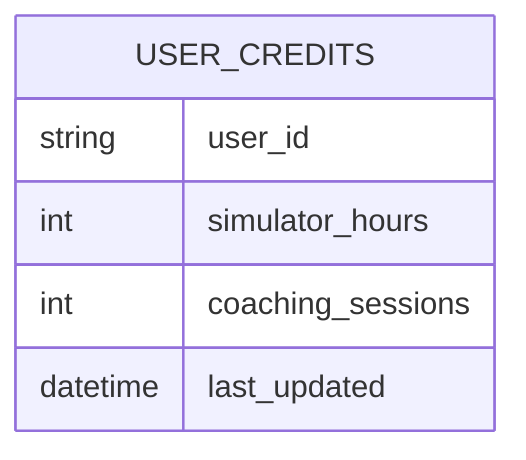
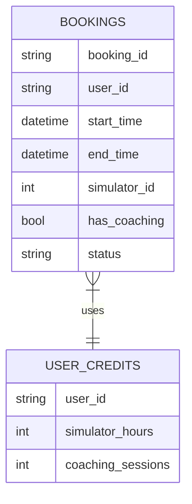

# Sim Studio Technical Implementation Plan

## Architecture Overview
- **Frontend**: Next.js headless frontend
- **Booking Engine**: Custom backend service
- **E-commerce**: Shopify Storefront API integration
- **Authentication**: Shopify Customer Accounts

## Core Components

### 1. Booking System
- Handles 4 simulators with 1hr slots
- Supports:
  - Hourly bookings
  - Package bookings (10-session packs)
  - Coaching add-ons
  - Recurring bookings
- Google Calendar sync for:
  - Owner
  - Coaches (individual calendars)
  - Resources (simulators)

### 2. Credit Tracking

- Tracks:
  - Simulator hours remaining
  - Coaching sessions remaining
  - Package usage

### 3. Shopify Integration
**Base Products:**
1. Simulator Hour
2. Coaching Session 
3. 10-Session Package

**Dynamic Cart Features:**
- Mixed bookings (e.g., 3 hours + 1 coaching)
- Package discounts
- Real-time availability validation

### 4. Calendar System
- Custom built on FullCalendar foundation
- Three view types:
  1. Admin: All resources
  2. Coach: Personal schedule
  3. User: Booking management

## Implementation Phases

### Phase 1: MVP
- Basic booking with credit tracking
- Shopify auth integration
- Simple calendar interface

### Phase 2: Core Features
- Recurring bookings
- Google Calendar sync
- Admin reporting dashboard
- Messaging system

### Phase 3: Enhancements
- Advanced calendar features
- Custom UI components
- Mobile optimizations

## Database Schema Highlights

## API Endpoints
- `/api/bookings` - Booking management
- `/api/credits` - Credit balance checks
- `/api/availability` - Real-time availability
- `/api/shopify` - Cart/webhook handlers
