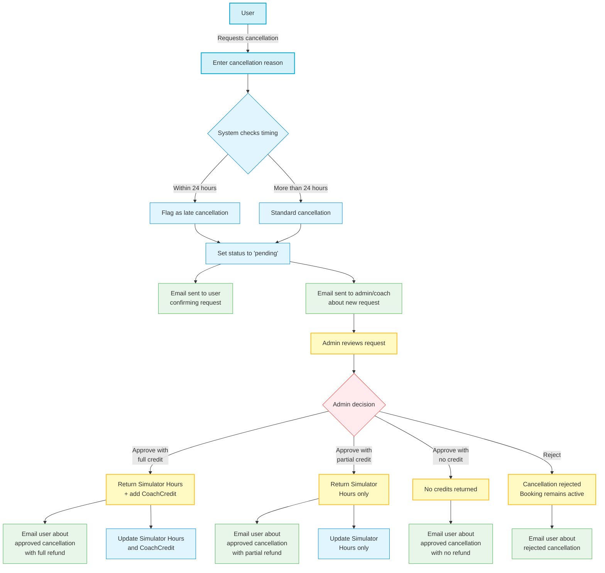

# Cancellation Approval Workflow

The following diagram illustrates the complete workflow for the cancellation approval system:

## Key Process Steps

1. **User Initiates Cancellation**
   - User requests to cancel a booking
   - System requires a cancellation reason

2. **System Processing**
   - System checks if cancellation is within 24 hours of booking
   - Flags late cancellations but still processes the request
   - Sets cancellation status to 'pending'
   - Sends notifications to user and admin/coach

3. **Admin Review**
   - Admin reviews the cancellation request
   - Can see booking details, user information, and cancellation reason
   - For late cancellations, timing is clearly highlighted

4. **Admin Decision**
   - Admin has multiple options:
     * Approve with full credit (Simulator Hours + CoachCredit)
     * Approve with partial credit (Simulator Hours only)
     * Approve with no credit
     * Reject the cancellation request

5. **Credit Processing**
   - If approved with full credit:
     * Simulator Hours are returned to user's credit balance
     * Coaching fee is converted to CoachCredit
   - If approved with partial credit:
     * Only Simulator Hours are returned
     * No CoachCredit is issued
   - If approved with no credit:
     * No credits are returned to the user

6. **Final Notifications**
   - User receives email about the decision
   - Email includes details about any refunded credits
   - For rejections, includes admin's reason (if provided)
